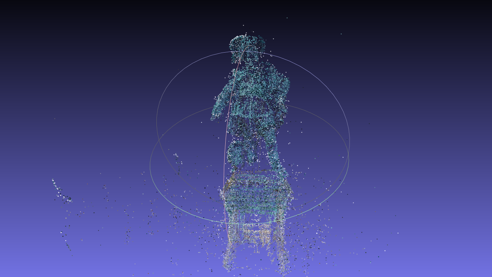

# 立体 3D 重建

自述文件分为两部分，
1.来自运动的结构（用于相机参数和稀疏重建）：这里实现了来自运动的增量结构。
2.多视图立体（用于密集重建）：稍后进行。

## 运动结构 (SfM)

### 执行步骤

1. 将存储库克隆为``git clone https://github.com/FlagArihant2000/sfm-mvs```
2.``cd sfm-mvs``。图像目录（第 30 行）以及相机参数（第 16 行）可以相应更新。
3. 运行``python3 sfm.py``。
4. 如果执行成功，打开``sparse.ply``以使用meshlab分析稀疏重建。

### 管道
1. 获取第一对图像。
2.使用SIFT检测特征。
3.使用暴力KNN进行特征匹配。良好的特征匹配是将距离比（根据 Lowe 的论文）设为 0.7。
4. 计算基本矩阵，以关联相机位置。使用 RANSAC 拒绝异常值。
5. 使用 SVD 从基本矩阵中获取等效旋转矩阵 (R) 和平移向量 (t)。
6.计算每个相机位置的投影矩阵，并计算点对应关系的三角测量。
7.利用重投影误差分析三角点的正确性。三角测量点被重新映射到图像平面上，并计算匹配点之间的偏差。 （请注意，在代码中，旋转矩阵使用罗德里格斯方程转换为向量）。这将是基础点云，新注册的图像将添加到该基础点云上。
8. 考虑新图像，该图像应使用透视 -n -点 (PnP) 进行配准。为此，我们需要新图像的 3D -2D 对应关系。因此，考虑图像 2 和 3 的共同特征，并且仅将那些在新添加的图像中可见的点（数据关联）用于 PnP。 PnP 之后，我们得到图像的世界姿态估计。
9. 该图像现在可以看到原始点云中不存在的新点。因此，三角测量也是如此。再次计算重投影误差。
10. 现在，对于每个新添加的图像，管道将从步骤 8 开始重复。

### 数据集

使用的数据集是古斯塔夫二世阿道夫的雕像（[链接](http://www.maths.lth.se/matematiklth/personal/calle/dataset/dataset.html)）。所有图像均用于获取稀疏点云。

示例图像：


＃＃＃ 输出



